# AI Personal Learning Assistant

By

Zafar Akram

Project submitted in partial fulfillment of the requirements for the degree of

BACHELOR OF SCIENCE IN COMPUTER SCIENCE

Department of Computer Science

Government College University Faisalabad

2026

---

## Declaration

This project titled **AI Personal Learning Assistant** is developed as a final year project for academic learning and practical implementation. The system, documentation, design diagrams, database structure, and implementation details are the result of project work, study, and research. Any external tools, libraries, frameworks, or AI services used during development have been acknowledged in the references section.

The project has not been submitted previously for any other degree or examination. The developer takes full responsibility for the authenticity, originality, and implementation of the software system.

Student Name: Zafar Akram

Supervisor Name: ______________________

Department: Computer Science

Signature: ______________________

---

## Dedication

I dedicate this project to Almighty Allah, my family, my teachers, and my friends who supported and encouraged me during the completion of this final year project. Their guidance, patience, and motivation helped me complete this work with dedication.

---

## Acknowledgement

I would like to express sincere gratitude to my project supervisor, teachers, classmates, and family members for their continuous support and guidance. I also acknowledge the open-source technologies used in this project, including PHP, MySQL, Bootstrap, Bootstrap Icons, Chart.js, and AI API services. Their availability made it possible to build a useful web-based learning assistant for students.

---

## Table of Contents

1. Chapter 1: Introduction
2. Chapter 2: Software Requirement Specification
3. Chapter 3: Analysis
4. Chapter 4: Design
5. Chapter 5: Development
6. Chapter 6: Testing
7. Chapter 7: Implementation
8. Chapter 8: Tools and Technologies
9. Appendix A: User Documentation
10. Appendix B: References

---

# Chapter 1: Introduction

## 1.1 Introduction

The **AI Personal Learning Assistant** is a web-based academic support system designed for students. It helps students create AI-generated study plans, generate adaptive quizzes from course outlines, chat with an AI tutor, save AI-generated resources as notes, manage assignments, track progress, and view performance analytics through charts.

The project is especially useful for university students because it supports the structure:

**University > Course > Semester > Subject > Outline**

For example, the system supports GCUF BSCS outlines and can auto-load semester-wise subjects. Students can also enter custom universities, courses, subjects, and outlines.

## 1.2 Background

Students often face difficulty in organizing study schedules, preparing quizzes from syllabus outlines, tracking assignments, and revising weak topics. Traditional study methods require manual planning and do not provide personalized feedback. This project solves these problems by combining a learning management interface with AI-based study support.

## 1.3 Purpose

The purpose of this project is to build a centralized student learning platform that can:

- Generate study plans automatically from a course outline.
- Generate quizzes from a selected subject outline.
- Provide AI chat-based tutoring.
- Create AI learning resources and save them as notes.
- Track study sessions, quizzes, assignments, goals, and progress.
- Present real data through dashboard graphs.

## 1.4 Scope

The system includes:

- User registration and login.
- Profile and theme management.
- GCUF BSCS course outline parsing.
- Semester-wise subject selection.
- AI-generated study plans.
- Plan session status tracking.
- AI-generated quizzes and retake quizzes.
- AI chat tutor with "Teach me" support from planner.
- AI learning resources and auto-save as notes.
- Notes management with parsed content view.
- Assignment management.
- Notifications.
- Dashboard analytics with multiple charts.

## 1.5 Objectives

- To reduce manual effort in academic planning.
- To generate quizzes according to subject outlines.
- To help students revise topics using AI explanations.
- To provide real-time academic progress tracking.
- To improve learning through personalized plans and practice.

## 1.6 Intended Audience

The intended users are:

- University students
- BSCS students
- Teachers or supervisors
- Project evaluators
- Academic institutions

## 1.7 Process Model

The project follows the **Iterative and Incremental Model**. Features were developed step by step:

1. Authentication and dashboard
2. Study planner
3. AI quiz generation
4. Course outline parsing
5. AI resources and notes
6. Analytics and graphs
7. UI improvements and dark mode

## 1.8 Document Convention

- System modules are written in bold.
- Database tables are written in code format.
- Diagrams are written using Mermaid syntax.
- Functional requirements are represented as FR.
- Non-functional requirements are represented as NFR.

---

# Chapter 2: Software Requirement Specification

## 2.1 Overall Description

### 2.1.1 Product Perspective

AI Personal Learning Assistant is a standalone web application built using PHP, MySQL, HTML, CSS, JavaScript, Bootstrap, and AI APIs. It runs locally on Laragon or any PHP/MySQL server.

### 2.1.2 Product Features

- Secure login and registration
- Student dashboard
- AI chat assistant
- AI study planner
- Course and semester management
- Adaptive quiz generator
- Quiz retake system
- Exam preparation page
- Study notes
- AI learning resources
- Progress analytics
- Assignment tracking
- Notifications
- Dark/light theme
- Profile dropdown and logout

### 2.1.3 Design and Implementation Constraints

- Requires PHP and MySQL.
- Requires browser support for Bootstrap and JavaScript.
- AI features depend on configured AI APIs.
- Internet is required for CDN libraries and external AI APIs.
- Local server is required for PHP execution.

### 2.1.4 Assumptions and Dependencies

- Users have basic computer and browser knowledge.
- MySQL server is running.
- API keys in `config/ai_config.php` are valid.
- Student provides correct course outline data.

## 2.2 Functional Requirements

| ID | Requirement |
|---|---|
| FR-01 | The system shall allow users to register and login. |
| FR-02 | The system shall allow users to update profile information. |
| FR-03 | The system shall allow students to generate AI study plans. |
| FR-04 | The system shall support university, course, semester, subject, and outline selection. |
| FR-05 | The system shall generate quizzes from subject outlines. |
| FR-06 | The system shall allow users to retake quizzes with new questions. |
| FR-07 | The system shall provide AI chat support. |
| FR-08 | The system shall allow planner topics to open in AI chat as "Teach me". |
| FR-09 | The system shall generate AI resources and save them as notes. |
| FR-10 | The system shall display real dashboard charts from database data. |
| FR-11 | The system shall manage assignments and statuses. |
| FR-12 | The system shall support dark and light mode. |
| FR-13 | The system shall allow logout from profile dropdown. |

## 2.3 Non-Functional Requirements

| ID | Requirement |
|---|---|
| NFR-01 | The system should be responsive on desktop and mobile screens. |
| NFR-02 | The system should use prepared statements to reduce SQL injection risk. |
| NFR-03 | Passwords should be stored using secure hashing. |
| NFR-04 | The UI should be simple, readable, and student-friendly. |
| NFR-05 | The system should provide fallback behavior when AI output is invalid. |
| NFR-06 | Charts should use real database values. |
| NFR-07 | The system should load pages quickly on a local server. |

## 2.4 External Interface Requirements

### 2.4.1 User Interface

The system uses a dashboard layout with a sidebar, top navigation, cards, modals, tables, charts, and forms.

### 2.4.2 Hardware Interface

Minimum hardware:

- Dual-core processor
- 4 GB RAM
- 500 MB free storage
- Internet connection for AI and CDN resources

### 2.4.3 Software Interface

- PHP 8.x
- MySQL
- Laragon or Apache server
- Modern browser
- AI APIs such as Gemini or Groq

### 2.4.4 Communication Interface

The browser communicates with PHP APIs using HTTP requests and JSON responses. AI APIs are called from server-side PHP.

---

# Chapter 3: Analysis

## 3.1 Actors

| Actor | Description |
|---|---|
| Student | Main user who creates plans, quizzes, notes, and assignments. |
| AI Service | External AI model used for chat, quiz, resources, and plans. |
| Database | Stores users, plans, quizzes, notes, progress, and assignments. |
| Admin/Teacher | Optional role for future system extension. |

## 3.2 Use Cases

### 3.2.1 Student Use Cases

- Register account
- Login
- Update profile
- Generate study plan
- Start/complete study session
- Create quiz
- Retake quiz
- Take quiz
- View result
- Ask AI tutor
- Generate resources
- Save note
- Manage assignments
- View progress analytics
- Logout

## 3.3 Use Case Diagram

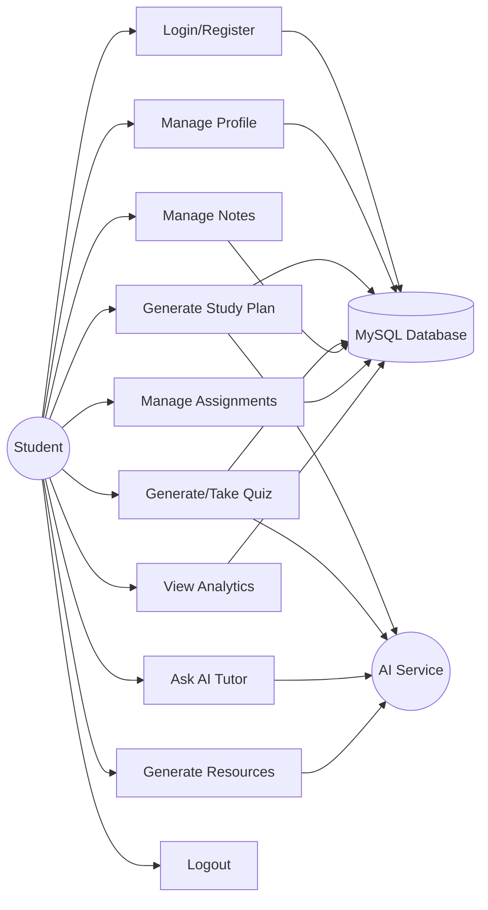

## 3.4 Event Flow: AI Study Plan

1. Student opens Study Planner.
2. Student selects University, Course, Semester, and Subject.
3. System loads outline automatically or allows custom outline.
4. Student selects start date, end date, time, duration, and off days.
5. System sends details to AI.
6. AI returns study sessions.
7. System saves sessions in database.
8. Student can start, complete, create quiz, or open teach mode.

## 3.5 Event Flow: Adaptive Quiz

1. Student opens Adaptive Quizzes.
2. Student selects University, Course, Semester, and Subject.
3. System loads subject outline.
4. Student selects difficulty and number of questions.
5. System sends outline to AI.
6. AI returns questions.
7. System saves quiz and questions.
8. Student attempts quiz.
9. System checks answers and stores score.
10. Student can retake quiz with new questions.

---

# Chapter 4: Design

## 4.1 System Architecture Diagram

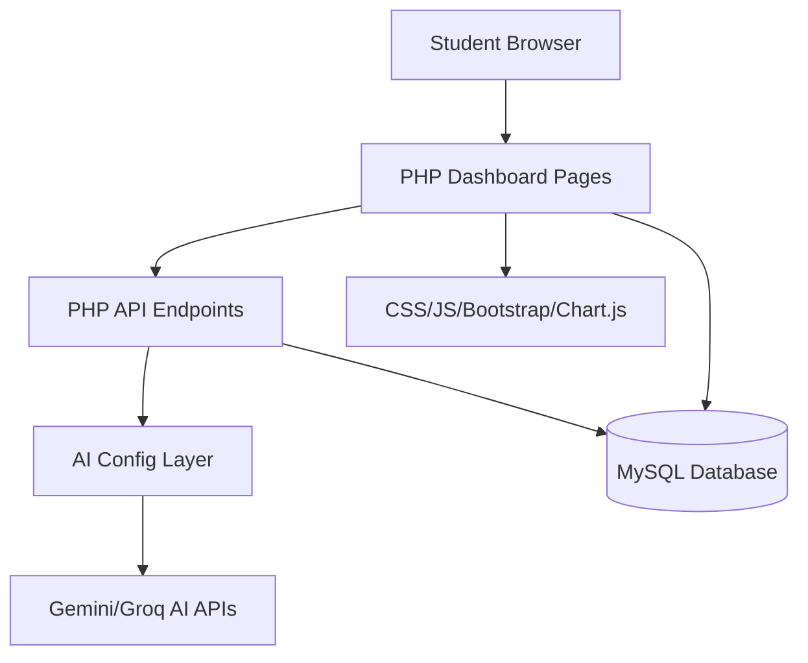

## 4.2 Entity Relationship Diagram

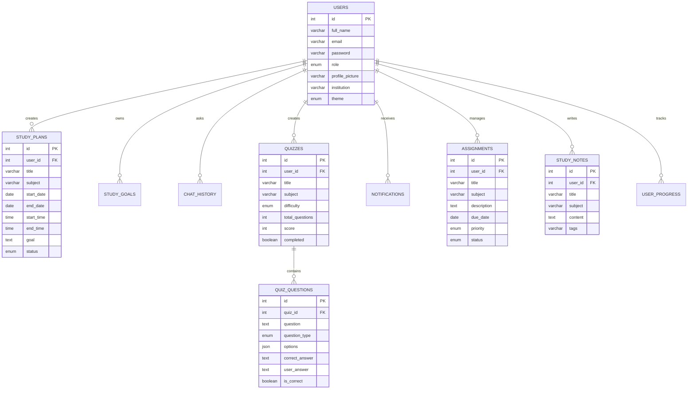

## 4.3 Data Dictionary

### users

| Field | Type | Description |
|---|---|---|
| id | INT | Primary key |
| full_name | VARCHAR | User full name |
| email | VARCHAR | Unique email |
| password | VARCHAR | Hashed password |
| role | ENUM | student, teacher, admin |
| profile_picture | VARCHAR | Uploaded profile image |
| institution | VARCHAR | Institution name |
| theme | ENUM | light or dark |

### study_plans

| Field | Type | Description |
|---|---|---|
| id | INT | Primary key |
| user_id | INT | User reference |
| title | VARCHAR | Study session title |
| subject | VARCHAR | Subject name |
| start_date | DATE | Session date |
| end_date | DATE | End date |
| start_time | TIME | Start time |
| end_time | TIME | End time |
| goal | TEXT | Learning goal |
| status | ENUM | pending, in_progress, completed |

### quizzes and quiz_questions

| Table | Purpose |
|---|---|
| quizzes | Stores quiz metadata, subject, difficulty, score |
| quiz_questions | Stores questions, options, correct answer, user answer |

## 4.4 Class Diagram

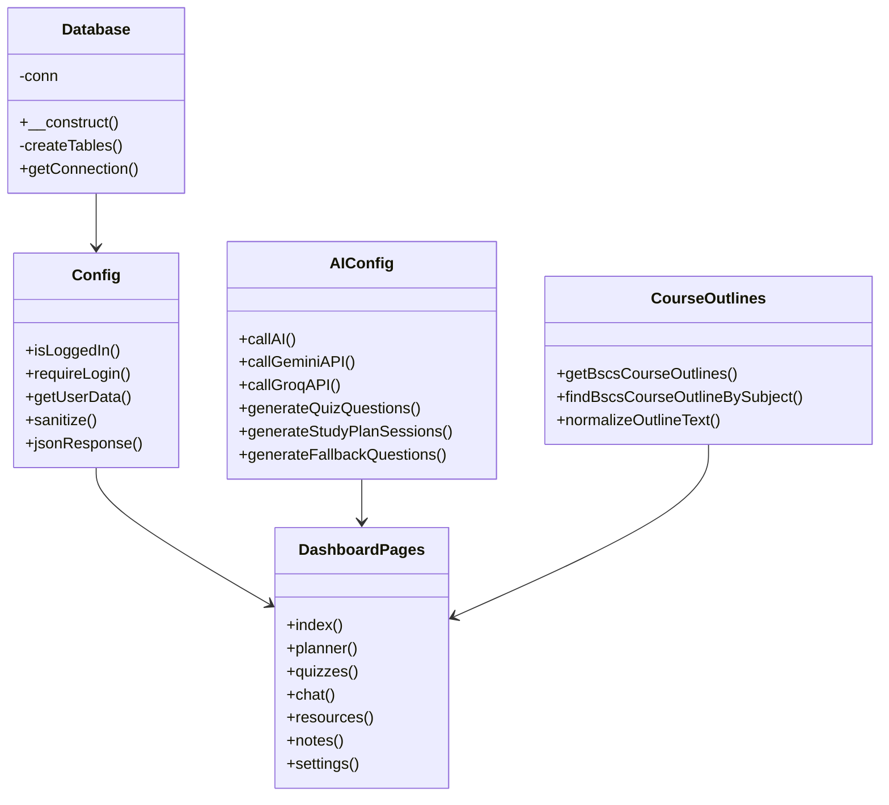

## 4.5 Object Diagram

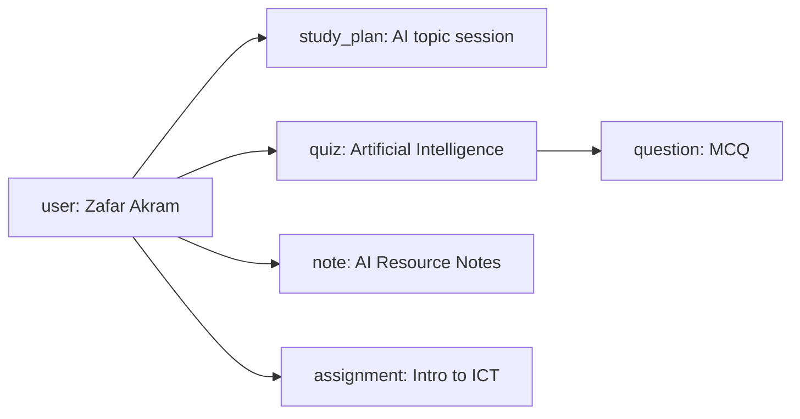

## 4.6 Sequence Diagram: Quiz Generation

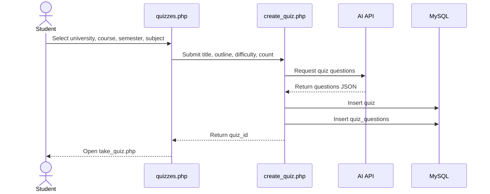

## 4.7 Activity Diagram: Study Plan Generation

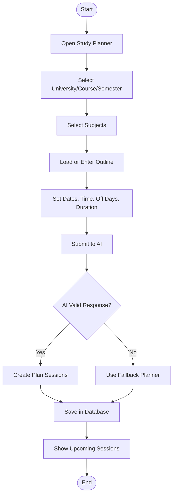

## 4.8 State Transition Diagram: Study Plan Status

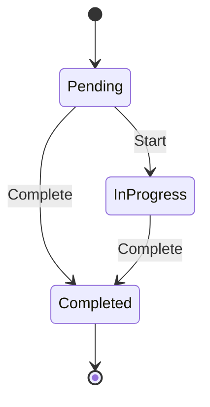

## 4.9 Collaboration Diagram

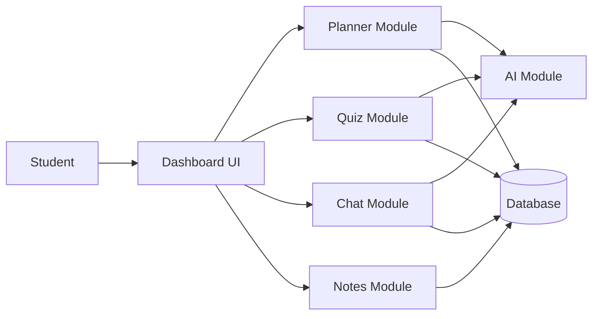

---

# Chapter 5: Development

## 5.1 Operating System

### Available Operating Systems

- Windows
- Linux
- macOS

### Selected Operating System

Windows was selected because the project is developed and tested using Laragon on Windows.

## 5.2 Development Approach

### Available Approaches

- Waterfall Model
- Spiral Model
- Incremental Model
- Agile Model

### Selected Approach

The selected approach is **Incremental Development** because the system was built feature by feature. Each module was implemented, tested, improved, and integrated with other modules.

## 5.3 Programming Language

### Available Languages

- PHP
- Python
- JavaScript
- Java
- C#

### Selected Language

PHP was selected for backend development because it is simple, widely used for web applications, and works well with MySQL and Laragon.

## 5.4 Platform

The selected platform is a web-based platform. The system can run in a browser through a local or online PHP server.

## 5.5 Database

### Available Databases

- MySQL
- PostgreSQL
- SQLite
- MongoDB

### Selected Database

MySQL was selected because it integrates easily with PHP and supports relational data such as users, quizzes, questions, notes, and assignments.

---

# Chapter 6: Testing

## 6.1 Testing Strategy

The project was tested using:

- Functional testing
- Black box testing
- Form validation testing
- Database testing
- AI response testing
- UI testing
- Syntax testing using PHP lint

## 6.2 Test Cases

| Test Case ID | Module | Input | Expected Output | Status |
|---|---|---|---|---|
| TC-01 | Registration | Valid user data | Account created | Pass |
| TC-02 | Login | Correct email/password | Dashboard opens | Pass |
| TC-03 | Login | Wrong password | Error shown | Pass |
| TC-04 | Study Planner | GCUF BSCS subject outline | AI plan generated | Pass |
| TC-05 | Study Planner | Off days selected | Sessions skip off days | Pass |
| TC-06 | Planner Status | Start button | Status becomes in_progress | Pass |
| TC-07 | Planner Status | Complete button | Status becomes completed | Pass |
| TC-08 | Plan Quiz | Day/session quiz | Quiz created from plan topic | Pass |
| TC-09 | Teach Me | Planner Teach button | Chat opens with teach prompt | Pass |
| TC-10 | Quiz Generator | Subject selected | Quiz created | Pass |
| TC-11 | Retake Quiz | Retake button | New quiz questions created | Pass |
| TC-12 | Take Quiz | Submit answers | Score calculated | Pass |
| TC-13 | Resources | Generate resource | AI resource displayed | Pass |
| TC-14 | Save Note | Save as note | Note stored and shown | Pass |
| TC-15 | Notes | View note | Parsed note content shown | Pass |
| TC-16 | Dashboard | Existing data | Real charts displayed | Pass |
| TC-17 | Theme | Dark mode toggle | UI changes to dark mode | Pass |
| TC-18 | Logout | Logout dropdown | User session ends | Pass |

## 6.3 Black Box Testing

Black box testing was used to verify that each module produced correct output without focusing on internal code.

## 6.4 White Box Testing

White box testing was used during API and PHP logic verification. Important code paths such as AI fallback generation, quiz submission, and plan status update were checked.

## 6.5 Boundary Value Testing

| Field | Boundary | Expected Result |
|---|---|---|
| Quiz questions | 1 question | Accepted if valid |
| Quiz questions | Large count | Limited by form/API |
| Date range | Same start/end date | Plan generated for one day |
| Empty outline | Custom prompt still accepted or fallback used |
| Empty subject | Validation message |

---

# Chapter 7: Implementation

## 7.1 Component Diagram

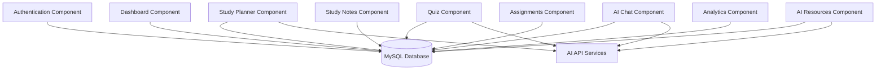

## 7.2 Deployment Diagram

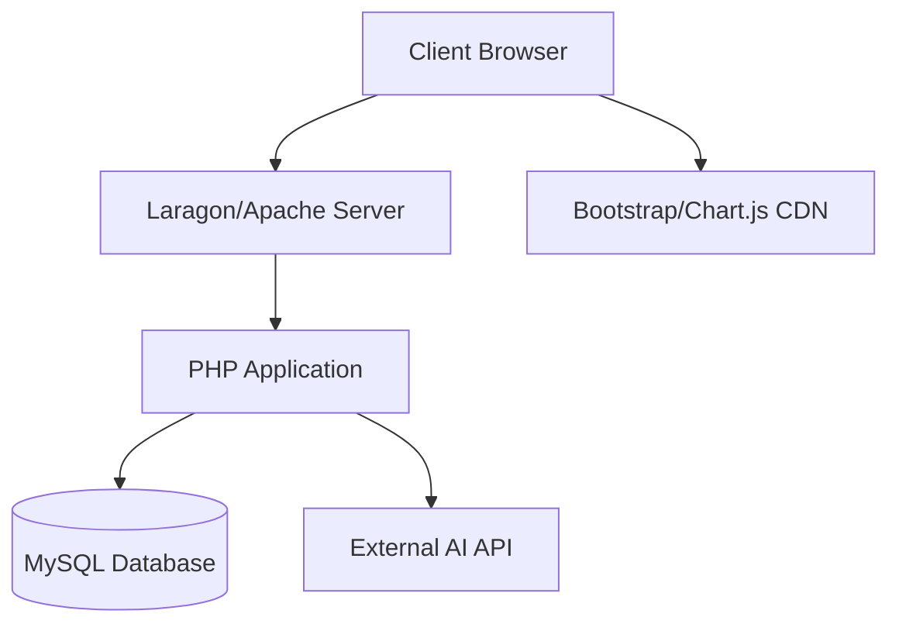

## 7.3 Database Architecture

The project uses a three-tier architecture:

1. **Presentation Tier:** HTML, CSS, Bootstrap, JavaScript
2. **Application Tier:** PHP dashboard pages and API files
3. **Data Tier:** MySQL database

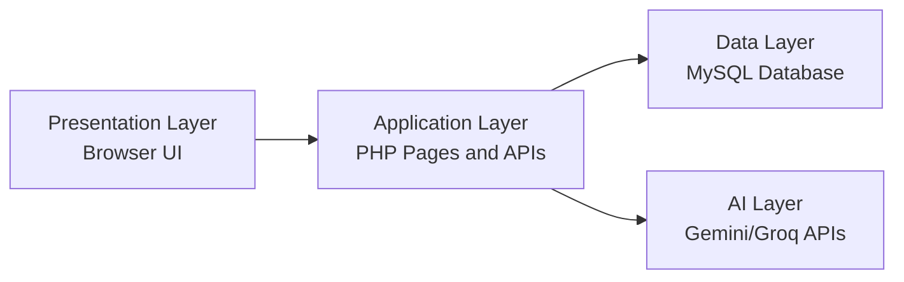

## 7.4 Main Project Modules

| Module | Files |
|---|---|
| Authentication | `auth/login.php`, `auth/register.php`, `auth/logout.php` |
| Dashboard | `dashboard/index.php` |
| Study Planner | `dashboard/planner.php`, `api/generate_plan.php`, `api/update_plan_status.php` |
| Quizzes | `dashboard/quizzes.php`, `dashboard/take_quiz.php`, `dashboard/quiz_result.php` |
| AI Chat | `dashboard/chat.php`, `api/chat.php` |
| Resources | `dashboard/resources.php`, `api/generate_resources.php` |
| Notes | `dashboard/notes.php`, `api/save_resource_note.php` |
| Assignments | `dashboard/assignments.php` |
| Analytics | `dashboard/progress.php`, Chart.js on dashboard |
| Configuration | `config/config.php`, `config/database.php`, `config/ai_config.php` |

---

# Chapter 8: Tools and Technologies

## 8.1 Programming Languages

- PHP
- JavaScript
- HTML
- CSS
- SQL

## 8.2 Frameworks and Libraries

- Bootstrap 5
- Bootstrap Icons
- Chart.js
- Mermaid diagrams for documentation

## 8.3 Database

- MySQL

## 8.4 Server Environment

- Laragon
- Apache
- PHP 8.x

## 8.5 AI Technologies

- Gemini API
- Groq API
- Prompt engineering
- JSON response parsing
- Fallback generation logic

---

# Appendix A: User Documentation

## A.1 Getting Started

1. Open the application in browser.
2. Register a new account.
3. Login using email and password.
4. Dashboard will show study stats, charts, recent sessions, and notifications.

## A.2 AI Study Planner

1. Open Study Planner.
2. Click AI Generate Plan.
3. Select University, Course, Semester, and Subject.
4. Review or edit the outline.
5. Select start/end date, daily time, session duration, and off days.
6. Click Generate.
7. Sessions will appear in Upcoming Study Sessions.
8. Use Start, Complete, Quiz, or Teach.

## A.3 Adaptive Quizzes

1. Open Adaptive Quizzes.
2. Click Create New Quiz.
3. Select University, Course, Semester, Subject, outline, difficulty, and question count.
4. Generate the quiz.
5. Attempt questions.
6. Submit answers.
7. View score and correct answers.
8. Click Retake New Quiz to generate different questions.

## A.4 AI Chat Assistant

1. Open AI Chat Assistant.
2. Type a study question.
3. Use prompt chips such as Step-by-step, Practice me, Exam notes, or Teach mode.
4. The AI returns formatted explanation.
5. From Study Planner, click Teach to open chat with a pre-filled topic prompt.

## A.5 AI Resources and Notes

1. Open Learning Resources.
2. Select subject and outline.
3. Generate AI resource.
4. Click Save as Note.
5. Open Study Notes to view parsed saved content.

## A.6 Assignments

1. Open Assignments.
2. Add title, subject, due date, description, and priority.
3. Mark assignment as submitted when completed.

## A.7 Settings and Logout

1. Open profile dropdown in top-right header.
2. Click Profile or Settings to update details.
3. Click Logout to end session.

---

# Appendix B: References

1. PHP Documentation: https://www.php.net/docs.php
2. MySQL Documentation: https://dev.mysql.com/doc/
3. Bootstrap Documentation: https://getbootstrap.com/docs/
4. Bootstrap Icons: https://icons.getbootstrap.com/
5. Chart.js Documentation: https://www.chartjs.org/docs/
6. Mermaid Diagrams: https://mermaid.js.org/
7. Google Gemini API Documentation
8. Groq API Documentation

---

# Appendix C: Source Code Summary

The complete source code is organized in the following directories:

```text
PLA/
  api/
  assets/
  auth/
  config/
  dashboard/
  includes/
  uploads/
```

Important files:

- `config/database.php`: Database connection and table creation.
- `config/ai_config.php`: AI API calls, quiz generation, plan generation.
- `config/course_outlines.php`: GCUF BSCS outline parser.
- `dashboard/index.php`: Main analytics dashboard.
- `dashboard/planner.php`: Study planner interface.
- `dashboard/quizzes.php`: Quiz generation and quiz list.
- `dashboard/chat.php`: AI tutor chat interface.
- `dashboard/resources.php`: AI resource generator.
- `dashboard/notes.php`: Saved notes module.

